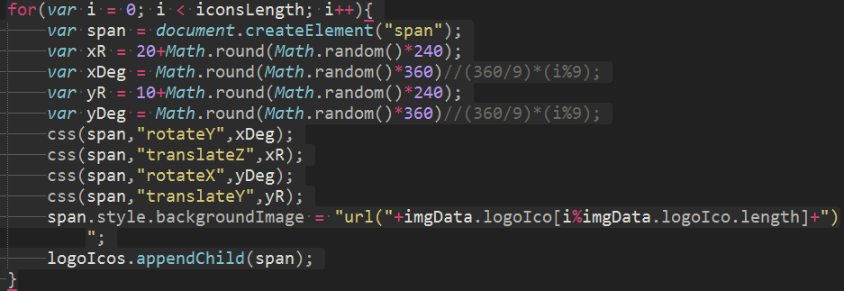
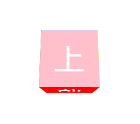
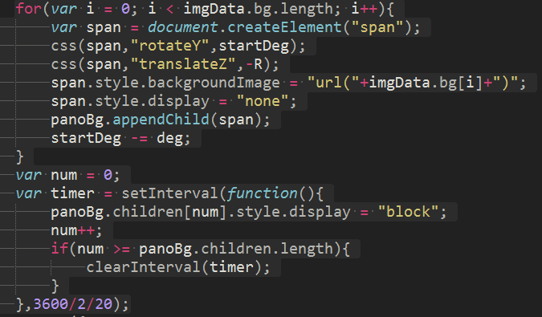
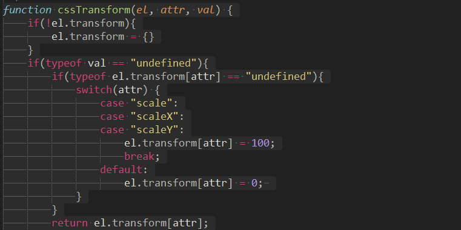
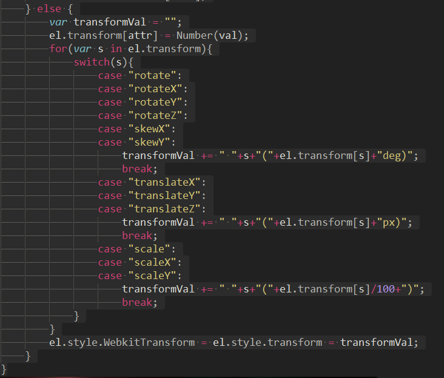
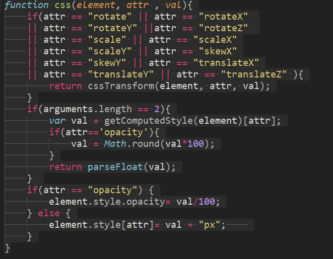
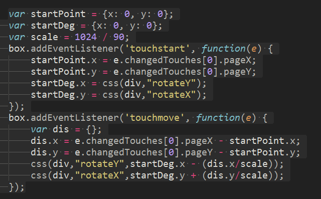
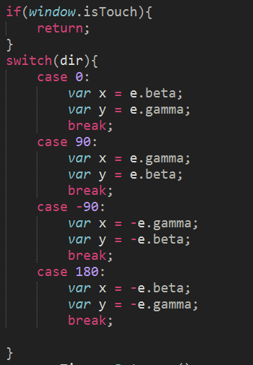

# css3、原生js、tween实现 购物节3D展示效果     
# 移动端输入 yus189.github.io 观看     
     
       

*   transform2D、transform3D
*   iOS下兼容
*   tween运动、transform样式的获取与设置
*   animation
*   3D坐标计算、3D内多面柱体的计算与制作
*   加载进度监控、移动端滑屏拖拽、拖拽缓冲
*   移动端横竖屏切换、角度监测、陀螺仪的设置
*   重力加速配合3D效果实现VR

## 动画步骤
1. loading动画配合图片加载进度监控
2. loading消失，安踏logo旋转出现并更换两次背景图
3. 安踏logo消失，出现“去打破”logo并伴随数个小三角形爆炸效果
4. 环绕云朵出现，之后主体圆柱出现，逐渐旋转并放大至眼前
5. 圆柱内漂浮层出现，动画结束可进行拖拽

### 1
通过aImg.onload事件监测进度，配合loading动画的3D旋转实现效果。
### 2
提前创建两个相同大小、不同背景的安踏logo，使其运动同步。
当loading动画结束时运动开始，第一个logo运动结束后消失，第二个logo出现。
animation控制旋转，translateZ控制放大缩小。
### 3
“去打破”logo的放大缩小运动同理于安踏logo的运动。
爆炸效果的实现如下所示： 

iconsLength即爆炸三角形的数量。
动画是围绕Y轴旋转的。给每个三角形设置随机的translateZ使其以不同的半径围绕Y轴旋转，设置随机的translateY使其错落显示3D效果，再设置其自身随机的旋转角度生成爆炸效果。   
### 4
爆炸效果结束后生成云朵，主体圆柱入场。这是最关键的一步。
云朵展示与爆炸效果原理相同。
而要实现多面柱体的内视效果并旋转入场我却是从translate3D开始研究的。   
   
首先，要实现一个3D盒子的外视效果很简单。
但这里要实现iOS兼容不能改变transform-origin 变换原点。   
会受到原点影响的变换有：rotate、skew、scale。所以需要改变的是translate。   

而要实现内视效果，需要每个面translateZ的数值变成其相反的值，同时配合backface-visibility: hidden;隐藏背面（即与父级角度相对的面）。这样只要调试好合适的景深便可实现立方体内视效果。    

柱体圆柱，其实是一个20个侧面的柱体。   
每个面距离旋转中心移动的距离为：
	Math.tan(角度*Math.PI/180)*临边。   
按顺序设置背景图片后，根据旋转速度使背景逐个显示出来，同时整体放大，便实现了入场效果。
 
主体入场中生成漂浮层。    
也就是另外生成圆柱体，设置漂浮物固定的旋转半径及旋转角度。    

### 5
拖拽！
在js中没有办法 通过计算后样式 获取到 transform中的相关操作，只能获取到矩阵。   
关于transform的所有操作，通过cssTransform函数进行操作，   
然后在cssTransform中记录对transform的每一步操作获取的时候就获取cssTransform中的记录。   

设置一个CSS方法。   
传入两个实参获取样式，传入三个实参设置样式。   
   

有了以上两个方法，便可以实现盒子的拖拽。   
 

拖拽结束后还要实现缓冲效果。   
利用touchmove事件中 最后一次移动的距离 / 最后一次移动所花费的时间,求得手指离开屏幕时的移动速度，利用tween使盒子进行速度递减的运动。

### 6
陀螺仪旋转 & 横竖屏切换     
手机的重力感应支持里，有两个主要的事件：    

1. OrientationChange (在屏幕发生翻转的时候触发)    

2. DeviceOrientation+DeviceMotion(重力感应与陀螺仪)    

orientationchange 横竖屏切换    

	window.orientation    
	iOS        -90 0 90    
	Android    0 90 180    
	var dir = window.orientation; //检测横竖屏    
	window.addEventListener('orientationchange', function(e) {    
		dir = window.orientation;//用户切换了横竖之后，重置方向    
	});    
根据这几种状态，控制横竖屏切换。    
    
根据当前屏幕的大小，来计算景深    
1. 固定视野的角度大小，根据角度的大小，计算出景深。    
2. 保持眼睛与景物之间的距离不变   

切换了横屏之后，左右旋转就不再是e.gamma，上下旋转也不再是e.beta，所以设置陀螺仪需检测横竖屏 。    

陀螺仪deviceorientation事件获得旋转角度。    
   

over！   

